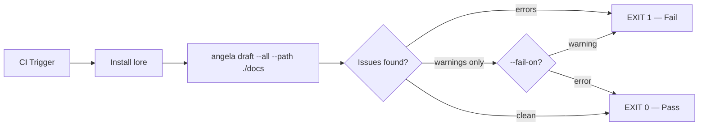
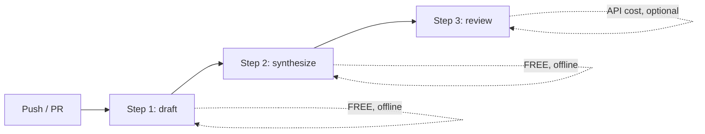
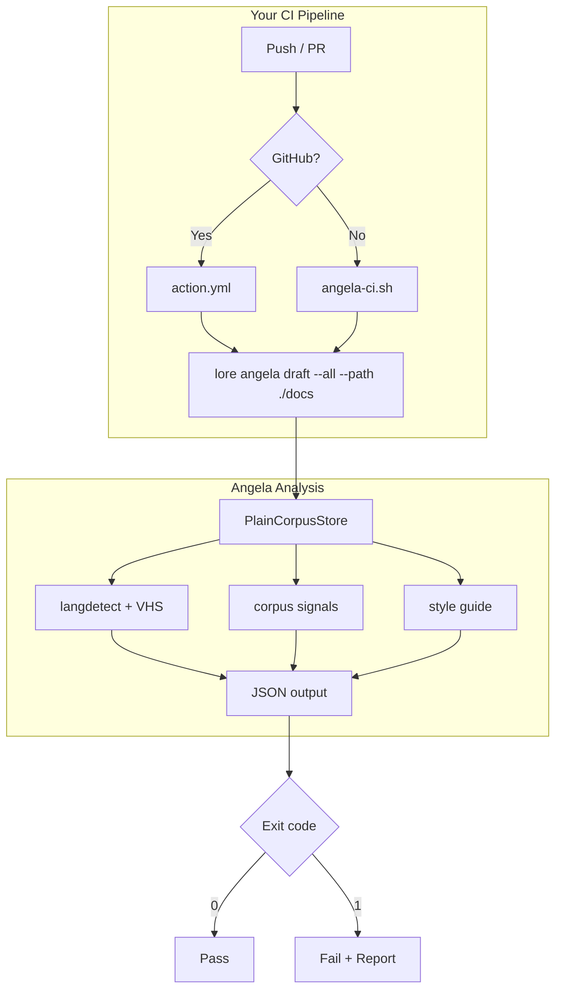

# Angela in CI — Documentation Quality Gate

Angela runs as a quality gate in any CI/CD pipeline, analyzing your Markdown documentation for structural issues, inconsistencies, and coherence problems — **without requiring `lore init`**. The draft mode is entirely offline (no API key, no cost); the review mode is opt-in and requires an AI provider, reserved for pre-release corpus-wide coherence checks.

## Why Use Angela in CI

Your documentation breaks silently. A developer adds an API endpoint but forgets to update the authentication section. Another removes a feature but leaves stale examples in three different files. A third writes "see the configuration guide" but never links to it.

Angela catches these issues before they reach production. Unlike linters that check syntax, Angela understands content relationships, cross-references, and documentation patterns that matter to humans.

## Draft Mode (Recommended for CI)

Runs entirely offline. Checks:

- **Missing sections** — Why/What/Alternatives on strict lore types (`decision`, `feature`, `bugfix`, `refactor`)
- **Style guide compliance** — heading structure, code block languages, link formats
- **Cross-document coherence** — shared tags, scope clusters, broken internal links
- **VHS tape ↔ documentation consistency** — info only, never blocks CI
- **Persona-based quality scoring** — strict types only

Draft mode never makes network calls. It analyzes your files locally and exits immediately.

### Using Angela on a non-lore documentation site

Angela is **safe to run on any Markdown docs site** — MkDocs, Docusaurus, Astro, Diátaxis, hand-rolled — even if you've never used `lore init`.

The analysis branches on the `type` field in front matter:

- **Strict types** (`decision`, `feature`, `bugfix`, `refactor`) — receive the full lore treatment: What/Why/Alternatives/Impact requirements, persona checks, and heavyweight scoring.
- **Everything else** — free-form profile. No section requirements, no persona checks; scoring rewards structure, density, and code examples rather than lore conventions.

Blog posts, tutorials, guides, concept pages, landing pages, and any custom type will not produce false-positive warnings. A well-written tutorial can reach 95/100 (A) on the free-form profile.

**Translation pairs** (e.g. `installation.md` and `installation.fr.md`) are detected automatically and will not be flagged as duplicates. Supported locale codes: `fr`, `en`, `es`, `de`, `it`, `pt`, `zh`, `ja`, `ko`, `ru`, `ar`, `nl`, `pl`.

**Partial front matter is preserved**: a document with only `type: decision` and `date:` (no `status`) keeps its declared type — it will not be silently downgraded to `note`.

## Quick Start

### GitHub Actions

```yaml
# .github/workflows/docs.yml
- uses: GreyCoderK/lore@v1
  with:
    mode: draft        # offline, free — no API key needed
    path: ./docs       # your markdown directory
    fail_on: error     # or: warning, none
```

### GitLab CI

```yaml
doc-review:
  stage: test
  script:
    - ./scripts/angela-ci.sh --path docs --fail-on warning --install
```

### Jenkins / Bitbucket / Any CI

```bash
./scripts/angela-ci.sh --path docs --fail-on error --install
```

## How It Works



Angela scans your documentation directory, analyzes each file for structural and content issues, then exits with code 0 (pass) or 1 (fail) based on your threshold.

No `.lore/` directory required. No configuration files. Just point it at a folder of Markdown files.

## Modes

| Mode | API Key | Cost | What it checks |
|------|---------|------|----------------|
| `draft` | No | Free | Structure, style, coherence, personas |
| `synthesize` | No | Free | Auto-generates API examples, SQL queries from doc content (offline) |
| `review` | Yes | ~$0.01-0.05 | Corpus-wide contradictions, gaps, obsolescence |

### Recommended 3-step CI pipeline



Steps 1 and 2 are entirely offline — no API key, no cost. Step 3 (review) is optional and only needed for corpus-wide coherence checks (pre-release, periodic audits).

### GitHub Actions (3-step pipeline)

```yaml
# .github/workflows/docs.yml
name: Documentation Quality
on: [push, pull_request]

jobs:
  docs:
    runs-on: ubuntu-latest
    steps:
      - uses: actions/checkout@v4

      # Step 1: Offline structural check (free)
      - uses: GreyCoderK/lore@v1
        with:
          mode: draft
          path: ./docs
          fail_on: error

      # Step 2: Auto-generate API examples from existing doc content (free)
      - run: |
          for f in docs/*.md; do
            lore angela polish "$(basename $f)" --synthesize --set-status reviewed || true
          done

      # Step 3: AI coherence review (optional, only on tags)
      - if: startsWith(github.ref, 'refs/tags/v')
        uses: GreyCoderK/lore@v1
        with:
          mode: review
          path: ./docs
          api_key: ${{ secrets.ANTHROPIC_API_KEY }}
```

### Pre-planned external docs (no lore init)

Angela works on **any Markdown directory** — your team may plan documentation outside of lore (in a wiki, Confluence export, Notion export, or hand-written MkDocs site) and still benefit from Angela's analysis and synthesizer enrichment:

```bash
# External project — no .lore/ directory needed
lore angela draft --all --path ./external-wiki/

# Generate Postman examples from API specs in an external docs tree
lore angela polish api-endpoints.md --synthesize --path ./swagger-docs/
```

In standalone mode:
- Files with YAML front matter get full analysis
- Files without front matter get synthetic metadata (type=note)
- The synthesizer detects endpoints, filters, and security sections regardless of whether the doc was created by lore
- No `.lorerc` needed — sensible defaults apply

## Review Mode (Optional, for Releases)

Uses a single AI API call to find corpus-wide issues. Best suited for pre-release checks or periodic reviews — not every commit.

**API key required.** Unlike draft mode (free, offline), review mode makes one API call per run. Cost depends on corpus size and model:

| Model | Typical cost per review | Notes |
|-------|------------------------|-------|
| `claude-haiku-4-5-20251001` | ~$0.001–0.005 | Recommended for CI — fast, cheap |
| `claude-sonnet-4-6` | ~$0.01–0.05 | Better quality findings |
| `gpt-4o-mini` | ~$0.001–0.005 | Good alternative |
| `ollama/*` | Free | Self-hosted, no network cost |

Set the API key as a repository secret. Angela prints the estimated cost before calling the API. The CI job will not fail on cost overruns, but it will warn if the corpus is very large.

### With Anthropic (Claude) — default

```yaml
- uses: GreyCoderK/lore@v1
  if: startsWith(github.ref, 'refs/tags/v')
  with:
    mode: review
    path: ./docs
    api_key: ${{ secrets.ANTHROPIC_API_KEY }}
```

### With OpenAI (GPT)

```yaml
- uses: GreyCoderK/lore@v1
  if: startsWith(github.ref, 'refs/tags/v')
  with:
    mode: review
    path: ./docs
    api_key: ${{ secrets.OPENAI_API_KEY }}
    provider: openai
    model: gpt-4o
```

### With Ollama (Self-Hosted, Free)

If you run Ollama on your CI runner (or as a sidecar service):

```yaml
services:
  ollama:
    image: ollama/ollama
    ports:
      - 11434:11434

steps:
  - run: curl -s http://localhost:11434/api/pull -d '{"name":"llama3.1"}'
  - uses: GreyCoderK/lore@v1
    with:
      mode: review
      path: ./docs
      provider: ollama
      model: llama3.1
      endpoint: http://ollama:11434
```

### With any OpenAI-compatible API

Any provider that exposes an OpenAI-compatible endpoint — Groq, Together, Mistral, Azure OpenAI, vLLM, LM Studio — works with `provider: openai`:

```yaml
- uses: GreyCoderK/lore@v1
  with:
    mode: review
    path: ./docs
    api_key: ${{ secrets.GROQ_API_KEY }}
    provider: openai
    model: mixtral-8x7b-32768
    endpoint: https://api.groq.com
```

| Service | Endpoint | Model examples |
|---------|----------|---------------|
| **Groq** | `https://api.groq.com` | `mixtral-8x7b-32768`, `llama-3.1-70b-versatile` |
| **Together** | `https://api.together.xyz` | `meta-llama/Meta-Llama-3.1-70B-Instruct-Turbo` |
| **Mistral** | `https://api.mistral.ai` | `mistral-large-latest` |
| **Azure OpenAI** | `https://YOUR.openai.azure.com` | Your deployment name |
| **vLLM / LM Studio** | `http://localhost:8000` | Any loaded model |

## Script Options

The portable script supports both draft and review modes:

```bash
./scripts/angela-ci.sh [OPTIONS]

  --path <dir>        Path to markdown docs (default: ./docs)
  --mode <mode>       Analysis mode: draft (offline) or review (AI) (default: draft)
  --fail-on <level>   error | warning | none (default: error)
  --filter <regex>    Regex to filter documents by filename (review only)
  --all               Review all documents, no 25+25 sampling (review only)
  --install           Auto-install lore if not in PATH
  --version <ver>     Specific lore version (default: latest)
  --quiet             Suppress human-readable output
```

### Examples

```bash
# Draft (offline, free) — every push
./scripts/angela-ci.sh --path docs --fail-on warning --install

# Review (AI) — all docs
./scripts/angela-ci.sh --mode review --path docs --all --install

# Review — only command docs
./scripts/angela-ci.sh --mode review --path docs --filter "commands/.*" --install

# Review — quiet for log parsing
./scripts/angela-ci.sh --mode review --path docs --all --quiet --install
```

## Jenkins / Bitbucket / GitLab

The script works in any CI system. Set `LORE_AI_*` environment variables to enable review mode:

### Jenkins (Jenkinsfile)

```groovy
pipeline {
    environment {
        LORE_AI_PROVIDER = 'anthropic'
        LORE_AI_API_KEY  = credentials('anthropic-api-key')
        LORE_AI_TIMEOUT  = '120s'
    }
    stages {
        stage('Doc Draft') {
            steps {
                sh './scripts/angela-ci.sh --path docs --fail-on error --install'
            }
        }
        stage('Doc Review') {
            when { buildingTag() }
            steps {
                sh './scripts/angela-ci.sh --mode review --path docs --all --install'
            }
        }
    }
}
```

### Bitbucket Pipelines

```yaml
pipelines:
  default:
    - step:
        name: Doc Quality (offline)
        script:
          - ./scripts/angela-ci.sh --path docs --fail-on warning --install

  tags:
    'v*':
      - step:
          name: Doc Review (AI)
          script:
            - ./scripts/angela-ci.sh --mode review --path docs --all --install
          environment:
            LORE_AI_PROVIDER: openai
            LORE_AI_MODEL: gpt-4o
            LORE_AI_API_KEY: $OPENAI_API_KEY
            LORE_AI_TIMEOUT: 120s
```

### GitLab CI

```yaml
doc-draft:
  stage: test
  script:
    - ./scripts/angela-ci.sh --path docs --fail-on warning --install

doc-review:
  stage: test
  rules:
    - if: $CI_COMMIT_TAG =~ /^v/
  variables:
    LORE_AI_PROVIDER: anthropic
    LORE_AI_API_KEY: $ANTHROPIC_API_KEY
    LORE_AI_TIMEOUT: 120s
    LORE_ANGELA_MAX_TOKENS: 8192
  script:
    - ./scripts/angela-ci.sh --mode review --path docs --all --install
```

### Environment Variables

lore automatically reads `LORE_AI_*` environment variables (via Viper auto-env). No `.lorerc` file is needed in CI:

| Variable | Description | Example |
|----------|-------------|---------|
| `LORE_AI_PROVIDER` | AI provider | `anthropic`, `openai`, `ollama` |
| `LORE_AI_MODEL` | Model name | `claude-haiku-4-5-20251001`, `gpt-4o`, `llama3.1` |
| `LORE_AI_API_KEY` | API key (required for review, unless ollama) | `sk-ant-...`, `sk-...` |
| `LORE_AI_ENDPOINT` | Custom endpoint URL | `https://api.groq.com`, `http://localhost:11434` |
| `LORE_AI_TIMEOUT` | Request timeout | `120s` |
| `LORE_ANGELA_MAX_TOKENS` | Max output tokens | `8192` |

These variables work in **any CI system** — GitHub Actions, GitLab, Jenkins, Bitbucket, CircleCI, etc.

## Standalone Mode

Angela works on **any directory of Markdown files** — with or without YAML front matter:

- **With front matter**: Full analysis (type, tags, dates, scope clusters)
- **Without front matter**: Synthetic metadata derived from filename and modification date; structural and style checks still apply

You can add Angela to any project with a `docs/` folder, regardless of whether you use lore.

## Integration Architecture



## Viewing Diagrams

The diagrams in this documentation use [Mermaid](https://mermaid.js.org/). Here's how to view them in your environment:

| Environment | Solution | Link |
|-------------|----------|------|
| **VS Code** | Markdown Preview Mermaid extension | [Install](https://marketplace.visualstudio.com/items?itemName=bierner.markdown-mermaid) |
| **JetBrains** (IntelliJ, GoLand, etc.) | Mermaid plugin | [Install](https://plugins.jetbrains.com/plugin/20146-mermaid) |
| **Online** | Paste the block into the online editor | [mermaid.live](https://mermaid.live) |
| **MkDocs** | Automatic rendering via `pymdownx.superfences` | Already configured in this project |
| **GitHub** | Native rendering in `.md` files | No action required |

> **Non-technical audience?** If your audience can't render Mermaid diagrams, you can convert them to PNG/SVG images with [mermaid-cli](https://github.com/mermaid-js/mermaid-cli) (`mmdc`) and place them in `assets/diagrams/`.
