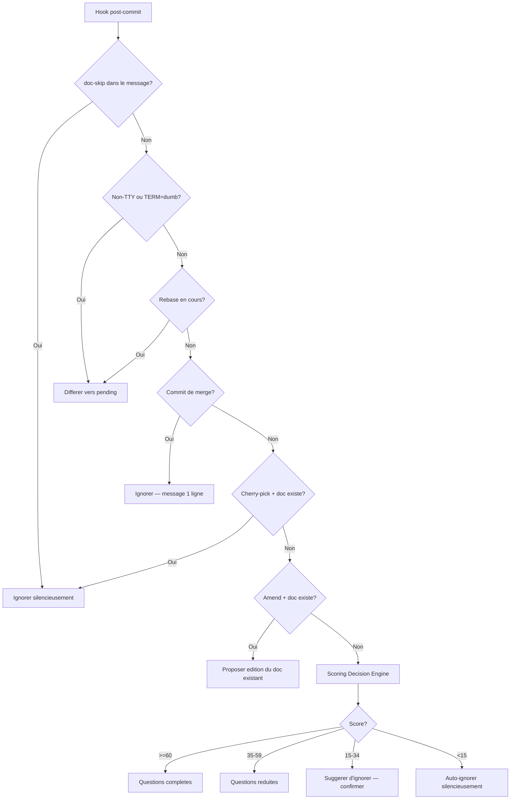

# Detection Contextuelle

Comment le hook post-commit de Lore decide quoi faire avec chaque commit.

## Vue d'ensemble

Quand le hook se declenche apres un commit, Lore evalue une chaine de regles. La premiere regle qui correspond l'emporte.

## Chaine de Detection

## Regles de Detection (Ordre de Priorite)

| # | Regle | Action | Raison |
|---|-------|--------|--------|
| 1 | `[doc-skip]` dans le message | Ignorer | Intention explicite du dev |
| 2 | Non-TTY ou `TERM=dumb` | Differer | CI/pipes ne doivent jamais bloquer |
| 3 | Rebase en cours | Differer | Eviter les prompts pendant le replay |
| 4 | Commit de merge (2+ parents) | Ignorer | Commits d'infrastructure |
| 5 | Cherry-pick + doc source existe | Ignorer | Deja documente |
| 6 | Amend + doc existant | Proposer modification | L'utilisateur edite du travail precedent |
| 7 | Score Decision Engine | Action basee sur le score | Analyse multi-signaux |

## Notifications IDE

Quand un commit est differe dans un IDE non-TTY :

1. **VS Code IPC** — Notification native (multi-instance)
2. **Dialog OS** — `osascript` (macOS), `zenity`/`kdialog` (Linux)
3. **Fallback** — Fichier lock (`~/.lore/notify.lock`)

## Tips & Tricks

- Utilisez `[doc-skip]` pour les commits triviaux (typos, config CI, bump de deps).
- Verifiez le scoring : `lore decision --explain HEAD` montre le detail.
- Apres un rebase, verifiez `lore pending` — les commits rebases ont ete differes.
- Ctrl+C pendant les questions sauvegarde les reponses partielles. `lore pending resolve` reprend.

## Voir aussi

- [lore decision](../commands/decision.md) — Inspecter le scoring
- [lore pending](../commands/pending.md) — Gerer les commits differes
- [Configuration](configuration.md) — Ajuster les seuils
