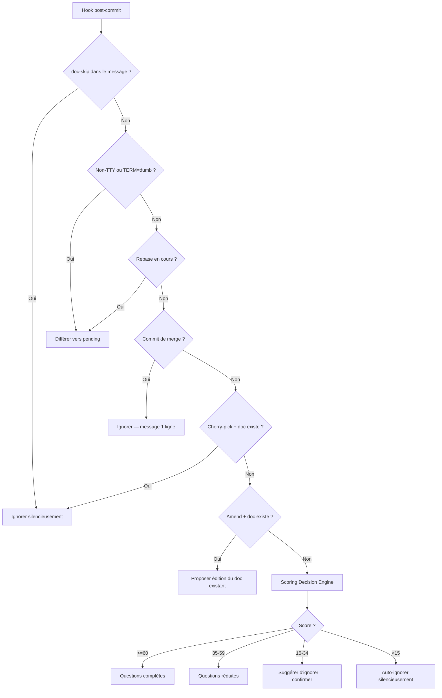

# Détection Contextuelle

Comment le hook post-commit de Lore décide quoi faire avec chaque commit.

## Vue d'ensemble

Quand le hook se déclenche après un commit, Lore évalue une chaîne de règles avant de poser des questions. La première règle qui correspond l'emporte.

## Chaîne de Détection



## Règles de Détection (Ordre de Priorité)

| # | Règle | Action | Raison |
|---|-------|--------|--------|
| 1 | `[doc-skip]` dans le message | Ignorer (silencieux) | Intention explicite du développeur |
| 2 | Non-TTY ou `TERM=dumb` | Différer vers pending | CI/pipes ne doivent jamais bloquer |
| 3 | Rebase en cours | Différer vers pending | Éviter les prompts pendant le replay |
| 4 | Commit de merge (2+ parents) | Ignorer (1 ligne msg) | Commits d'infrastructure |
| 5 | Cherry-pick + doc source existe | Ignorer silencieusement | Déjà documenté |
| 6 | Amend + doc existant | Question 0 + [M]/[C]/[I] | L'utilisateur édite du travail précédent |
| 7 | Score Decision Engine | Action basée sur le score | Analyse multi-signaux |

## Workflow Amend

Quand `git commit --amend` est détecté et qu'un document existe pour le commit pré-amend :

1. **Question 0** : "Amend détecté. Documenter ce changement ? [O/n]" — ignorer pour les corrections de typo
2. **Choix** : "[M]ettre à jour / [C]réer nouveau / [I]gnorer ?"
   - **Mettre à jour** : Pré-remplit Type, What et Why depuis le document existant, puis l'écrase
   - **Créer** : Crée un nouveau document (l'original reste)
   - **Ignorer** : Ne rien faire

Configurer via `.lorerc` :

```yaml
hooks:
  amend_prompt: true  # Mettre à false pour ignorer la Question 0
```

## Détection Non-TTY

Quand Lore s'exécute dans un environnement non-interactif :

| Environnement | Détection | Comportement |
|---------------|-----------|-------------|
| **CI/CD** (GitHub Actions, etc.) | `!isatty(stdin)` | Différé silencieusement |
| **Terminal IDE** (VS Code, JetBrains) | `isatty` + détection env | Questions normales ou notification |
| **Pipe** (`git commit \| ...`) | `!isatty(stdin)` | Différé silencieusement |
| **Cron/scripts** | `!isatty(stdin)` | Différé silencieusement |

Les terminaux VS Code sont detectes via la variable d'environnement `GIT_ASKPASS` que VS Code injecte (contenant "code" dans le chemin). Les forks sont identifies par leurs chaines specifiques : "cursor", "windsurf", "codium". Un signal secondaire est `VSCODE_GIT_ASKPASS_NODE`.

> **Important :** Cette detection a lieu **avant** la verification TTY. Meme si le terminal integre est un vrai TTY, Lore identifie l'environnement comme VS Code et passe en mode notification.

## Notifications IDE

Quand un commit a lieu dans un contexte IDE detecte, Lore envoie une notification au lieu de poser des questions interactives :

1. **VS Code IPC** — Notification native de l'extension (multi-instance)
2. **Dialog OS** — `osascript` (macOS), `zenity`/`kdialog` (Linux), PowerShell (Windows)
3. **Fallback** — Notification par fichier lock (`~/.lore/notify.lock`)

## Patterns de Skip

### Skip explicite

Ajoutez `[doc-skip]` n'importe où dans votre message de commit :

```bash
git commit -m "chore: update deps [doc-skip]"
# → Lore ignore silencieusement, compte comme "couvert" dans les métriques
```

### Auto-skip du Decision Engine

Certains types de commits sont auto-ignorés par défaut :

```yaml
# .lorerc
decision:
  always_skip: [docs, style, ci, build]
```

Les commits avec ces types conventionnels sont scorés à 0 et ignorés silencieusement.

## Dépannage

### "Lore affiche un dialog au lieu des questions interactives dans VS Code"

Lore detecte VS Code via `GIT_ASKPASS` et passe en mode notification. Pour forcer le mode interactif terminal :

```bash
# Ponctuel
unset GIT_ASKPASS
git commit -m "votre message"
```

Pour **restaurer** `GIT_ASKPASS`, ouvrez un nouveau terminal VS Code (VS Code le reinjecte automatiquement), ou lancez :

```bash
export GIT_ASKPASS="$(which code) --wait --reuse-window"
```

**Recommande : utilisez un alias** au lieu d'un unset global :

```bash
# Ajouter a ~/.zshrc ou ~/.bashrc
alias gc='GIT_ASKPASS= git commit'
```

Ainsi `gc -m "message"` declenche Lore interactif, et `git commit` garde le comportement VS Code.

> **Note :** Un `unset GIT_ASKPASS` permanent desactive aussi le credential helper Git de VS Code. Si vous utilisez des remotes HTTPS, configurez les credentials separement : `git config --global credential.helper osxkeychain`

### "Lore ne se déclenche pas après mon commit"

Vérifiez dans cet ordre :

1. **Hook installé ?** `grep "LORE" .git/hooks/post-commit`
2. **Hook exécutable ?** `ls -la .git/hooks/post-commit` (devrait montrer `-rwx`)
3. **`lore` dans le PATH ?** `which lore`
4. **Score trop bas ?** `lore decision --explain HEAD` — peut-être auto-skip
5. **Non-TTY ?** Vérifiez `lore pending` — le commit a peut-être été différé

### "Lore pose trop de questions pour des commits triviaux"

Ajoutez des overrides dans `.lorerc` :

```yaml
decision:
  always_skip: [docs, style, ci, build, chore]
  threshold_full: 70    # Plus haut = moins de questions complètes
```

Ou utilisez `[doc-skip]` dans vos messages de commit pour des cas ponctuels.

## Tips & Tricks

- **`[doc-skip]` pour les commits triviaux** — typos, config CI, bump de deps.
- **Vérifiez le scoring :** `lore decision --explain HEAD` montre le détail complet.
- **Personnalisez :** `always_ask` et `always_skip` dans `.lorerc` sont vos contrôles les plus puissants.
- **Après un rebase :** Vérifiez `lore pending` — les commits rebasés ont été différés.
- **Ctrl+C est sûr :** Les réponses partielles sont sauvées. `lore pending resolve` reprend.

## Voir aussi

- [lore decision](../commands/decision.md) — Inspecter le scoring pour n'importe quel commit
- [lore pending](../commands/pending.md) — Gérer les commits différés
- [Configuration](configuration.md) — Ajuster les seuils et overrides
