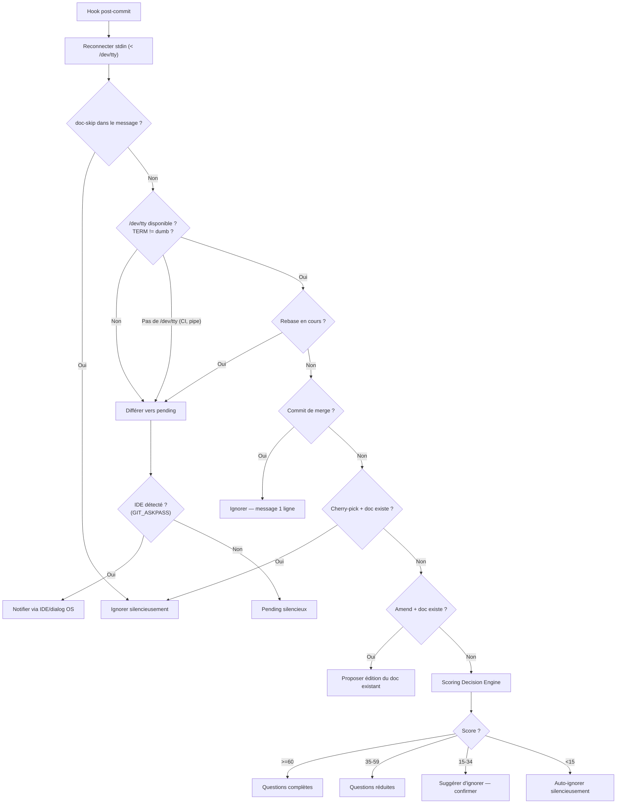

# Détection Contextuelle

Comment le hook post-commit de Lore décide quoi faire avec chaque commit.

## Vue d'ensemble

Quand le hook se déclenche après un commit, Lore évalue une chaîne de règles avant de poser des questions. La première règle qui correspond l'emporte.

## Chaîne de Détection



## Règles de Détection (Ordre de Priorité)

| # | Règle | Action | Raison |
|---|-------|--------|--------|
| 1 | `[doc-skip]` dans le message | Ignorer (silencieux) | Intention explicite du développeur |
| 2 | Non-TTY ou `TERM=dumb` | Différer vers pending | CI/pipes ne doivent jamais bloquer |
| 3 | Rebase en cours | Différer vers pending | Éviter les prompts pendant le replay |
| 4 | Commit de merge (2+ parents) | Ignorer (1 ligne msg) | Commits d'infrastructure |
| 5 | Cherry-pick + doc source existe | Ignorer silencieusement | Déjà documenté |
| 6 | Amend + doc existant | Question 0 + [M]/[C]/[I] | L'utilisateur édite du travail précédent |
| 7 | Score Decision Engine | Action basée sur le score | Analyse multi-signaux |

## Workflow Amend

Quand `git commit --amend` est détecté et qu'un document existe pour le commit pré-amend :

1. **Question 0** : "Amend détecté. Documenter ce changement ? [O/n]" — ignorer pour les corrections de typo
2. **Choix** : "[M]ettre à jour / [C]réer nouveau / [I]gnorer ?"
   - **Mettre à jour** : Pré-remplit Type, What et Why depuis le document existant, puis l'écrase
   - **Créer** : Crée un nouveau document (l'original reste)
   - **Ignorer** : Ne rien faire

Configurer via `.lorerc` :

```yaml
hooks:
  amend_prompt: true  # Mettre à false pour ignorer la Question 0
```

## Comment stdin fonctionne dans les hooks Git

Git redirige stdin vers `/dev/null` pour les hooks — même quand on commit depuis un terminal interactif. Cela signifie que `isatty(stdin)` retourne toujours `false` à l'intérieur d'un hook.

Le hook de Lore résout cela en reconnectant stdin depuis le terminal :

```sh
exec lore _hook-post-commit < /dev/tty
```

C'est pourquoi les questions interactives fonctionnent dans les terminaux (iTerm, Terminal.app, terminal intégré VS Code) mais **pas** dans les environnements où `/dev/tty` n'est pas disponible (CI, Docker, pipes).

> **Windows :** Git utilise Git Bash (MSYS2) pour les hooks, qui fournit `/dev/tty`. Les questions interactives fonctionnent dans Git Bash, Windows Terminal et le terminal intégré VS Code. PowerShell et CMD sans Git Bash différent vers pending.

## Détection Non-TTY

Après reconnexion de stdin via `/dev/tty`, Lore vérifie si stdin est un vrai TTY :

| Environnement | `/dev/tty` | `isatty(stdin)` | Comportement |
|---------------|-----------|-----------------|-------------|
| **Terminal** (iTerm, Terminal.app) | Disponible | `true` | Questions interactives |
| **Terminal intégré VS Code** | Disponible | `true` | Questions interactives |
| **CI/CD** (GitHub Actions, Docker) | Indisponible | `false` | Différé silencieusement |
| **Pipe** (`git commit \| ...`) | Indisponible | `false` | Différé silencieusement |
| **Cron/scripts** | Indisponible | `false` | Différé silencieusement |

Quand stdin n'est pas un TTY, le commit est différé vers pending. Si un IDE est détecté (via `GIT_ASKPASS`), Lore envoie aussi une notification.

### Détection IDE pour les notifications

Après le report, Lore détecte l'environnement IDE pour envoyer une notification. VS Code et ses forks sont identifiés via la variable `GIT_ASKPASS` (contenant "code", "cursor", "windsurf" ou "codium" dans le chemin). Un signal secondaire est `VSCODE_GIT_ASKPASS_NODE`.

## Notifications IDE

Quand un commit est différé et qu'un IDE est détecté, Lore envoie une notification :

1. **VS Code IPC** — Notification native de l'extension (multi-instance)
2. **Dialog OS** — `osascript` (macOS), `zenity`/`kdialog` (Linux), PowerShell (Windows)
3. **Fallback** — Notification par fichier lock (`~/.lore/notify.lock`)

## Patterns de Skip

### Skip explicite

Ajoutez `[doc-skip]` n'importe où dans votre message de commit :

```bash
git commit -m "chore: update deps [doc-skip]"
# → Lore ignore silencieusement, compte comme "couvert" dans les métriques
```

### Auto-skip du Decision Engine

Certains types de commits sont auto-ignorés par défaut :

```yaml
# .lorerc
decision:
  always_skip: [docs, style, ci, build]
```

Les commits avec ces types conventionnels sont scorés à 0 et ignorés silencieusement.

## Dépannage

### "Lore affiche un dialog au lieu des questions interactives"

Votre hook est probablement ancien — il manque la redirection `< /dev/tty` qui reconnecte stdin depuis le terminal. Réinstallez :

```bash
lore hook uninstall
lore hook install
```

Vérifiez :

```bash
grep "dev/tty" .git/hooks/post-commit
# Devrait afficher : exec lore _hook-post-commit < /dev/tty
```

### "Lore ne se déclenche pas après mon commit"

Vérifiez dans cet ordre :

1. **Hook installé ?** `grep "LORE" .git/hooks/post-commit`
2. **Hook exécutable ?** `ls -la .git/hooks/post-commit` (devrait montrer `-rwx`)
3. **`lore` dans le PATH ?** `which lore`
4. **Score trop bas ?** `lore decision --explain HEAD` — peut-être auto-skip
5. **Non-TTY ?** Vérifiez `lore pending` — le commit a peut-être été différé

### "Lore pose trop de questions pour des commits triviaux"

Ajoutez des overrides dans `.lorerc` :

```yaml
decision:
  always_skip: [docs, style, ci, build, chore]
  threshold_full: 70    # Plus haut = moins de questions complètes
```

Ou utilisez `[doc-skip]` dans vos messages de commit pour des cas ponctuels.

## Tips & Tricks

- **`[doc-skip]` pour les commits triviaux** — typos, config CI, bump de deps.
- **Vérifiez le scoring :** `lore decision --explain HEAD` montre le détail complet.
- **Personnalisez :** `always_ask` et `always_skip` dans `.lorerc` sont vos contrôles les plus puissants.
- **Après un rebase :** Vérifiez `lore pending` — les commits rebasés ont été différés.
- **Ctrl+C est sûr :** Les réponses partielles sont sauvées immédiatement dans `.lore/pending/` à n'importe quel niveau (sélecteur de type, What, Why, prompts amend). `lore pending resolve` reprend.

## Voir aussi

- [lore decision](../commands/decision.md) — Inspecter le scoring pour n'importe quel commit
- [lore pending](../commands/pending.md) — Gérer les commits différés
- [Configuration](configuration.md) — Ajuster les seuils et overrides
