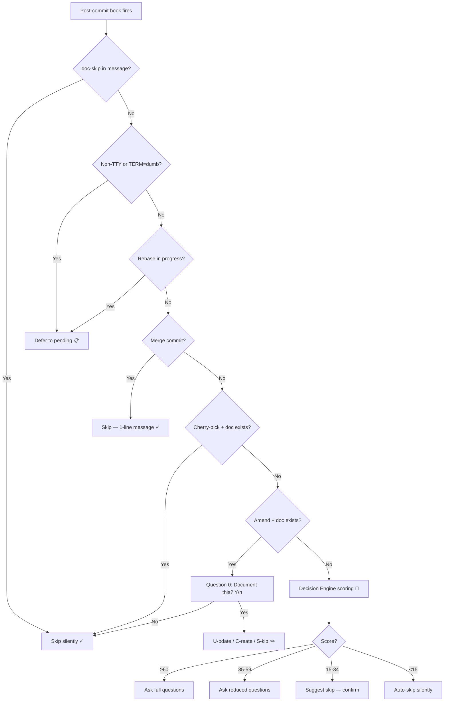

# Contextual Detection

How Lore's post-commit hook decides what to do with each commit.

## Overview

When the hook fires after a commit, Lore evaluates a chain of rules before asking any questions. The first matching rule wins.

## Detection Chain



## Detection Rules (Priority Order)

| # | Rule | Action | Reason |
|---|------|--------|--------|
| 1 | `[doc-skip]` in commit message | Skip (silent) | Explicit developer intent |
| 2 | Non-TTY or `TERM=dumb` | Defer to pending | CI/pipes must never block |
| 3 | Rebase in progress | Defer to pending | Avoid prompts during replay |
| 4 | Merge commit (2+ parents) | Skip (1-line msg) | Infrastructure commits |
| 5 | Cherry-pick + source doc exists | Skip silently | Already documented |
| 6 | Amend + existing doc | Question 0 + [U]/[C]/[S] | User editing prior work |
| 7 | Decision Engine score | Score-based action | Multi-signal analysis |

## Amend Workflow

When `git commit --amend` is detected and a document exists for the pre-amend commit:

1. **Question 0**: "Amend detected. Document this change? [Y/n]" — skip for trivial typo fixes
2. **Choice**: "[U]pdate existing / [C]reate new / [S]kip?"
   - **Update**: Pre-fills Type, What, and Why from the existing document, then overwrites it
   - **Create**: Creates a new document (the original remains)
   - **Skip**: Does nothing

Configure via `.lorerc`:

```yaml
hooks:
  amend_prompt: true  # Set to false to skip Question 0
```

## Non-TTY Detection

When Lore runs in a non-interactive environment:

| Environment | Detection | Behavior |
|-------------|-----------|----------|
| **CI/CD** (GitHub Actions, etc.) | `!isatty(stdin)` | Silent defer to pending |
| **IDE terminal** (VS Code, JetBrains) | `isatty` but env detection | Normal questions OR notification |
| **Pipe** (`git commit \| ...`) | `!isatty(stdin)` | Silent defer to pending |
| **Cron/scripts** | `!isatty(stdin)` | Silent defer to pending |

VS Code terminals are detected via `TERM_PROGRAM=vscode` and support native notifications via IPC.

## IDE Notifications

When a commit is deferred in a non-TTY IDE context, Lore sends a notification:

1. **VS Code IPC** — Native extension notification (multi-instance aware)
2. **OS Dialog** — `osascript` (macOS), `zenity`/`kdialog` (Linux), PowerShell (Windows)
3. **Fallback** — Lock file notification (`~/.lore/notify.lock`)

## Skip Patterns

### Explicit Skip

Add `[doc-skip]` anywhere in your commit message:

```bash
git commit -m "chore: update deps [doc-skip]"
# → Lore skips silently, counts as "covered" in metrics
```

### Decision Engine Auto-Skip

Certain commit types are auto-skipped by default:

```yaml
# .lorerc
decision:
  always_skip: [docs, style, ci, build]
```

Commits with these conventional types are scored at 0 and skip silently.

## Tips & Tricks

- Use `[doc-skip]` for trivial commits (typo fixes, CI config, dependency bumps).
- Check what would happen: `lore decision --explain HEAD` shows the full scoring breakdown.
- Customize `always_ask` and `always_skip` in `.lorerc` to match your team's conventions.
- Rebased commits go to pending — run `lore pending resolve` after a rebase.
- If you Ctrl+C during questions, partial answers are saved. Resume with `lore pending resolve`.

## See Also

- [lore decision](../commands/decision.md) — Inspect scoring for any commit
- [lore pending](../commands/pending.md) — Manage deferred commits
- [Configuration](configuration.md) — Tune thresholds and overrides
