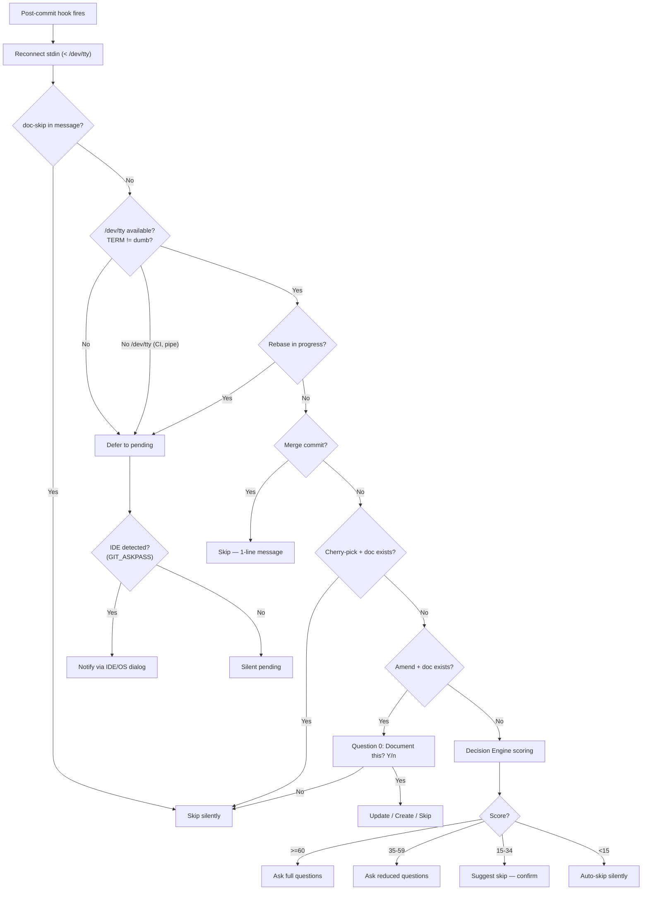

# Contextual Detection

How Lore's post-commit hook decides what to do with each commit.

## Overview

When the hook fires after a commit, Lore evaluates a chain of rules before asking any questions. The first matching rule wins.

## Detection Chain



## Detection Rules (Priority Order)

| # | Rule | Action | Reason |
|---|------|--------|--------|
| 1 | `[doc-skip]` in commit message | Skip (silent) | Explicit developer intent |
| 2 | Non-TTY or `TERM=dumb` | Defer to pending | CI/pipes must never block |
| 3 | Rebase in progress | Defer to pending | Avoid prompts during replay |
| 4 | Merge commit (2+ parents) | Skip (1-line msg) | Infrastructure commits |
| 5 | Cherry-pick + source doc exists | Skip silently | Already documented |
| 6 | Amend + existing doc | Question 0 + [U]/[C]/[S] | User editing prior work |
| 7 | Decision Engine score | Score-based action | Multi-signal analysis |

## Amend Workflow

When `git commit --amend` is detected and a document exists for the pre-amend commit:

1. **Question 0**: "Amend detected. Document this change? [Y/n]" — skip for trivial typo fixes
2. **Choice**: "[U]pdate existing / [C]reate new / [S]kip?"
   - **Update**: Pre-fills Type, What, and Why from the existing document, then overwrites it
   - **Create**: Creates a new document (the original remains)
   - **Skip**: Does nothing

Configure via `.lorerc`:

```yaml
hooks:
  amend_prompt: true  # Set to false to skip Question 0
```

## How stdin Works in Git Hooks

Git redirects stdin to `/dev/null` for hooks — even when you commit from an interactive terminal. This means `isatty(stdin)` always returns `false` inside a hook.

Lore's hook solves this by reconnecting stdin from the terminal:

```sh
exec lore _hook-post-commit < /dev/tty
```

This is why interactive questions work in terminal emulators (iTerm, Terminal.app, VS Code integrated terminal) but **not** in environments where `/dev/tty` is unavailable (CI, Docker, pipes).

> **Windows:** Git uses Git Bash (MSYS2) for hooks, which provides `/dev/tty`. Interactive questions work in Git Bash, Windows Terminal, and VS Code integrated terminal. PowerShell and CMD without Git Bash defer to pending.

## Non-TTY Detection

After reconnecting stdin via `/dev/tty`, Lore checks whether stdin is a real TTY:

| Environment | `/dev/tty` | `isatty(stdin)` | Behavior |
|-------------|-----------|-----------------|----------|
| **Terminal** (iTerm, Terminal.app) | Available | `true` | Interactive questions |
| **VS Code integrated terminal** | Available | `true` | Interactive questions |
| **CI/CD** (GitHub Actions, Docker) | Not available | `false` | Silent defer to pending |
| **Pipe** (`git commit \| ...`) | Not available | `false` | Silent defer to pending |
| **Cron/scripts** | Not available | `false` | Silent defer to pending |

When stdin is not a TTY, the commit is deferred to pending. If an IDE is detected (via `GIT_ASKPASS`), Lore also sends a notification.

### IDE Detection for Notifications

After deferring, Lore detects the IDE environment to send a notification. VS Code and its forks are identified via the `GIT_ASKPASS` environment variable (containing "code", "cursor", "windsurf", or "codium" in the path). A secondary signal is `VSCODE_GIT_ASKPASS_NODE`.

## IDE Notifications

When a commit is deferred and an IDE is detected, Lore sends a notification:

1. **VS Code IPC** — Native extension notification (multi-instance aware)
2. **OS Dialog** — `osascript` (macOS), `zenity`/`kdialog` (Linux), PowerShell (Windows)
3. **Fallback** — Lock file notification (`~/.lore/notify.lock`)

## Skip Patterns

### Explicit Skip

Add `[doc-skip]` anywhere in your commit message:

```bash
git commit -m "chore: update deps [doc-skip]"
# → Lore skips silently, counts as "covered" in metrics
```

### Decision Engine Auto-Skip

Certain commit types are auto-skipped by default:

```yaml
# .lorerc
decision:
  always_skip: [docs, style, ci, build]
```

Commits with these conventional types are scored at 0 and skip silently.

## Troubleshooting

### "Lore shows a dialog instead of interactive questions"

Your hook is probably outdated — it's missing the `< /dev/tty` redirect that reconnects stdin from the terminal. Reinstall:

```bash
lore hook uninstall
lore hook install
```

Verify:

```bash
grep "dev/tty" .git/hooks/post-commit
# Should show: exec lore _hook-post-commit < /dev/tty
```

### "Lore doesn't trigger after my commit"

Check in this order:

1. **Hook installed?** `grep "LORE" .git/hooks/post-commit`
2. **Hook executable?** `ls -la .git/hooks/post-commit` (should show `-rwx`)
3. **`lore` in PATH?** `which lore`
4. **Score too low?** `lore decision --explain HEAD` — might be auto-skipped
5. **Non-TTY?** Check `lore pending` — the commit may have been deferred

### "Lore asks too many questions for trivial commits"

Add overrides in `.lorerc`:

```yaml
decision:
  always_skip: [docs, style, ci, build, chore]
  threshold_full: 70    # Higher = fewer full questions
```

Or use `[doc-skip]` in your commit messages for one-off cases.

## Tips & Tricks

- Use `[doc-skip]` for trivial commits (typo fixes, CI config, dependency bumps).
- Check what would happen: `lore decision --explain HEAD` shows the full scoring breakdown.
- Customize `always_ask` and `always_skip` in `.lorerc` to match your team's conventions.
- Rebased commits go to pending — run `lore pending resolve` after a rebase.
- If you Ctrl+C during any question (type selector, What, Why, amend prompts), partial answers are saved immediately to `.lore/pending/`. Resume with `lore pending resolve`.

## See Also

- [lore decision](../commands/decision.md) — Inspect scoring for any commit
- [lore pending](../commands/pending.md) — Manage deferred commits
- [Configuration](configuration.md) — Tune thresholds and overrides
