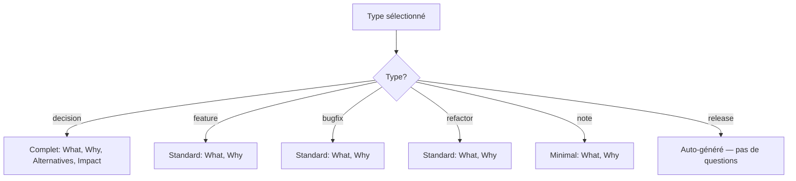

# Types de Documents & Métadonnées

Référence complète des types, statuts et métadonnées front matter.

## Types de Documents

| Type | But | Quand l'utiliser |
|------|-----|------------------|
| **`decision`** | Décisions architecturales, choix de design | "Pourquoi X plutôt que Y ?" — choix de base de données, framework, API |
| **`feature`** | Implémentations de nouvelles fonctionnalités | "Que fait cette feature et pourquoi ?" — endpoints, composants, intégrations |
| **`bugfix`** | Corrections de bugs | "Qu'est-ce qui était cassé et pourquoi ?" — race conditions, cas limites |
| **`refactor`** | Refactoring, optimisation | "Pourquoi restructurer ?" — extraction de packages, déduplication |
| **`release`** | Notes de version | Auto-généré par `lore release` |
| **`note`** | Notes générales, observations | "Bon à savoir" — notes de réunion, recherches |

## Flux de Questions par Type



Les documents **decision** ont des champs supplémentaires (Alternatives, Impact) car les choix architecturaux nécessitent plus de contexte.

## Statuts de Documents

| Statut | Signification | Défini par |
|--------|---------------|------------|
| **`draft`** | En cours | Par défaut à la création |
| **`published`** | Final, revu | Manuel ou après `angela polish` |
| **`archived`** | Obsolète, remplacé | Manuel |
| **`demo`** | Créé par `lore demo` | `lore demo` uniquement |

## Référence Front Matter

```yaml
---
type: feature                         # REQUIS: decision|feature|bugfix|refactor|release|note
date: 2026-03-16                      # REQUIS: date de création (YYYY-MM-DD)
status: draft                         # REQUIS: draft|published|archived|demo
commit: abc1234567890abcdef           # Optionnel: hash du commit git associé
tags: [auth, security, jwt]           # Optionnel: tags pour la recherche
related: [decision-auth-2026-03-07.md] # Optionnel: documents liés
generated_by: hook                    # Optionnel: hook|manual|lore
angela_mode: polish                   # Optionnel: draft|polish|review
---
```

## Tips & Tricks

- **Choisir le type :** Hésitation entre `decision` et `feature` ? "Est-ce un choix entre options ?" → `decision`. "Est-ce une construction ?" → `feature`.
- **Tags consultables :** Utilisez des tags cohérents. `lore show --type decision` filtre par type ; les tags offrent une granularité plus fine.
- **Archiver plutôt que supprimer :** Préférez `status: archived` à la suppression — conserve l'historique.

## Voir aussi

- [lore new](../commands/new.md) — Créer des documents
- [lore show](../commands/show.md) — Rechercher par type
