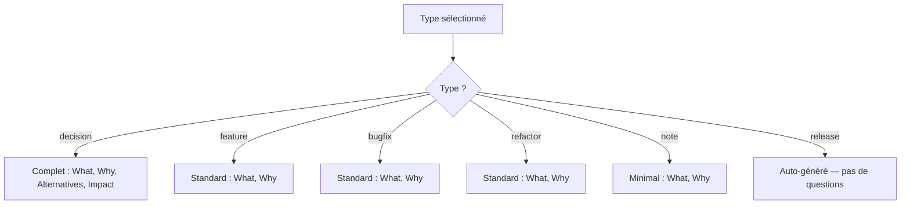
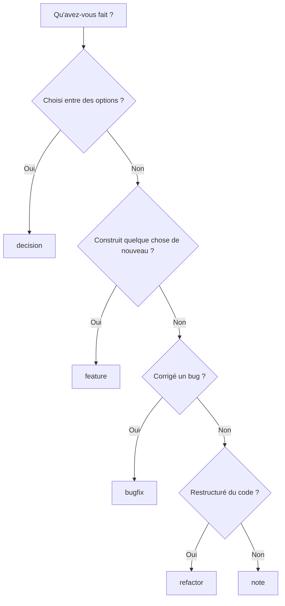

# Types de Documents & Métadonnées

Référence complète des types, statuts et métadonnées front matter.

## Types de Documents

Chaque document Lore a un `type` dans son front matter. Les types déterminent le flux de questions et comment les documents sont groupés dans les rapports.

| Type | But | Quand l'utiliser |
|------|-----|------------------|
| **`decision`** | Décisions architecturales, choix de design | "Pourquoi X plutôt que Y ?" — choix de base de données, framework, API |
| **`feature`** | Implémentations de nouvelles fonctionnalités | "Que fait cette feature et pourquoi ?" — nouveaux endpoints, composants, intégrations |
| **`bugfix`** | Corrections de bugs | "Qu'est-ce qui était cassé et pourquoi ?" — race conditions, cas limites, régressions |
| **`refactor`** | Refactoring, optimisation | "Pourquoi restructurer ?" — extraction de packages, déduplication, performance |
| **`release`** | Notes de version | Auto-généré par `lore release` — agrège les docs entre tags |
| **`note`** | Notes générales, observations | "Bon à savoir" — notes de réunion, recherches, avertissements |

## Flux de Questions par Type



Les documents **decision** ont des champs supplémentaires (Alternatives Considérées, Impact) car les choix architecturaux nécessitent plus de contexte.

## Statuts de Documents

| Statut | Signification | Défini par |
|--------|---------------|------------|
| **`draft`** | En cours | Par défaut à la création |
| **`published`** | Final, revu | Manuel ou après `angela polish` |
| **`archived`** | Obsolète, remplacé | Manuel |
| **`demo`** | Créé par `lore demo` | `lore demo` uniquement |

Les documents démo sont exclus des métriques de couverture et sautent la confirmation de suppression.

## Choisir le bon type (Flowchart)



## Référence Front Matter

Chaque document commence par du YAML front matter :

```yaml
---
type: feature                         # REQUIS : decision|feature|bugfix|refactor|release|note
date: 2026-03-16                      # REQUIS : date de création (YYYY-MM-DD)
status: draft                         # REQUIS : draft|published|archived|demo
commit: abc1234567890abcdef           # Optionnel : hash du commit git associé
tags: [auth, security, jwt]           # Optionnel : tags pour la recherche
related: [decision-auth-2026-03-07.md] # Optionnel : documents liés
generated_by: hook                    # Optionnel : hook|manual|lore
angela_mode: polish                   # Optionnel : draft|polish|review
---
```

## Exemples réels

### Document Decision

```markdown
---
type: decision
date: 2026-02-10
commit: c3d4e5f
tags: [database, infrastructure]
---
# Choix de base de données : PostgreSQL plutôt que MongoDB

## Why
Nous avons besoin de transactions ACID pour le flux de paiement.
Le driver pgx de PostgreSQL a un excellent support Go.

## Alternatives Considered
- MongoDB : Schéma flexible mais on réimplémenterait les clés étrangères
- SQLite : Excellent pour l'embarqué, pas pour une API multi-utilisateur

## Impact
Toute la persistance passe par PostgreSQL. Migrations via golang-migrate.
```

### Document Feature

```markdown
---
type: feature
date: 2026-02-15
commit: b2c3d4e
tags: [auth, security]
---
# Ajouter le middleware d'authentification JWT

## Why
L'API était complètement ouverte. JWT nous donne une auth stateless
qui scale horizontalement sans stockage de sessions.
```

### Document Bugfix

```markdown
---
type: bugfix
date: 2026-03-01
commit: d4e5f6a
tags: [auth, concurrence]
---
# Corriger la race condition du refresh de token

## Why
Deux requêtes concurrentes pouvaient toutes deux déclencher un refresh de token,
causant l'échec de l'une avec 401. Ajout d'un mutex autour de la logique de refresh.
```

## Tips & Tricks

- **Choisir le type :** Hésitation entre `decision` et `feature` ? "Est-ce un choix entre options ?" → `decision`. "Est-ce une construction ?" → `feature`. Toujours pas sûr ? → `note`.
- **Tags consultables :** Utilisez des tags cohérents. `lore show --type decision` filtre par type ; les tags offrent une granularité plus fine.
- **Documents liés :** Liez les décisions aux features qui les implémentent. Construit un graphe de connaissances.
- **Archiver plutôt que supprimer :** Préférez `status: archived` à la suppression — conserve l'historique.

## Voir aussi

- [lore new](../commands/new.md) — Créer des documents
- [lore show](../commands/show.md) — Rechercher par type
- [lore list](../commands/list.md) — Filtrer par type
