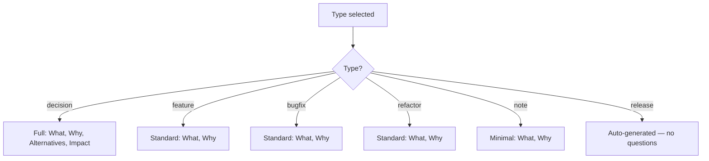
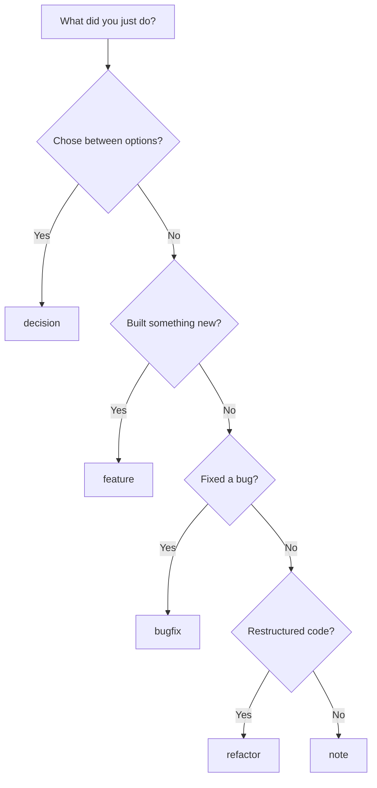

# Document Types & Metadata

Complete reference for Lore document types, statuses, and front matter metadata.

## Document Types

Every Lore document has a `type` in its front matter. Types determine the question flow and how documents are grouped in reports.

| Type | Purpose | When to use |
|------|---------|-------------|
| **`decision`** | Architectural decisions, design choices | "Why did we choose X over Y?" — database selection, framework choice, API design |
| **`feature`** | New feature implementations | "What does this feature do and why?" — new endpoints, UI components, integrations |
| **`bugfix`** | Bug fixes and patches | "What was broken and why?" — race conditions, edge cases, regressions |
| **`refactor`** | Code refactoring, optimization | "Why restructure this?" — extracting packages, reducing duplication, performance |
| **`release`** | Release notes and changelogs | Auto-generated by `lore release` — aggregates docs between tags |
| **`note`** | General notes, observations | "Good to know" — meeting notes, research findings, warnings |

## Question Flow by Type



**Decision** documents get additional fields (Alternatives Considered, Impact) because architectural choices need more context.

## Document Statuses

| Status | Meaning | Set by |
|--------|---------|--------|
| **`draft`** | Work in progress | Default on creation |
| **`published`** | Final, reviewed | Manual or after `angela polish` |
| **`archived`** | Obsolete, superseded | Manual |
| **`demo`** | Created by `lore demo` | `lore demo` only |

Demo documents are excluded from coverage metrics and skip delete confirmation.

## Front Matter Reference

Every document starts with YAML front matter:

```yaml
---
type: feature                         # REQUIRED: decision|feature|bugfix|refactor|release|note
date: 2026-03-16                      # REQUIRED: creation date (YYYY-MM-DD)
status: draft                         # REQUIRED: draft|published|archived|demo
branch: feature/auth                  # Optional: git branch at capture time (omitempty)
scope: auth                           # Optional: conventional commit scope (omitempty)
commit: abc1234567890abcdef           # Optional: associated git commit hash
tags: [auth, security, jwt]           # Optional: free-form tags for search
related: [decision-auth-2026-03-07.md] # Optional: related documents
generated_by: hook                    # Optional: hook|manual|lore
angela_mode: polish                   # Optional: draft|polish|review (set by Angela)
---
```

## Document Structure

```markdown
---
(front matter)
---
# Title

## Why
The core rationale — the most important section.

## Alternatives Considered
(decision type only) What other approaches were evaluated?

## Impact
(decision type only) What changed as a result?
```

## Tips & Tricks

- **Choosing types:** If unsure between `decision` and `feature`, ask: "Is this about choosing between options?" → `decision`. "Is this about building something?" → `feature`.
- **Tags are searchable:** Use consistent tags across documents. `lore show --type decision` filters by type; tags provide finer granularity.
- **Related documents:** Link decisions to the features that implement them. Builds a knowledge graph.
- **Archived, not deleted:** Prefer `status: archived` over deletion — keeps the historical record.

## Choosing the Right Type (Flowchart)



## Real Examples

### Decision Document

```markdown
---
type: decision
date: 2026-02-10
commit: c3d4e5f
tags: [database, infrastructure]
---
# Database Selection: PostgreSQL over MongoDB

## Why
We need ACID transactions for the payment flow. PostgreSQL's
pgx driver has excellent Go support.

## Alternatives Considered
- MongoDB: Flexible schema but we'd reimplement foreign keys
- SQLite: Great for embedded, not for multi-user API

## Impact
All persistence through PostgreSQL. Migrations via golang-migrate.
```

### Feature Document

```markdown
---
type: feature
date: 2026-02-15
commit: b2c3d4e
tags: [auth, security]
---
# Add JWT Auth Middleware

## Why
The API was completely open. JWT gives us stateless auth
that scales horizontally without session storage.
```

### Bugfix Document

```markdown
---
type: bugfix
date: 2026-03-01
commit: d4e5f6a
tags: [auth, concurrency]
---
# Fix Token Refresh Race Condition

## Why
Two concurrent requests could both trigger a token refresh,
causing one to fail with 401. Added mutex around refresh logic.
```

## See Also

- [lore new](../commands/new.md) — Create documents
- [lore show](../commands/show.md) — Search by type
- [lore list](../commands/list.md) — Filter by type
