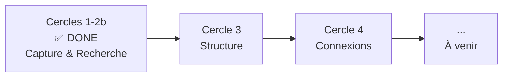
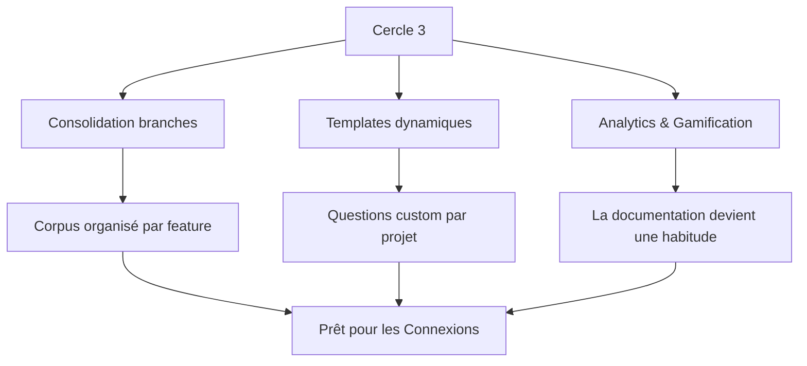
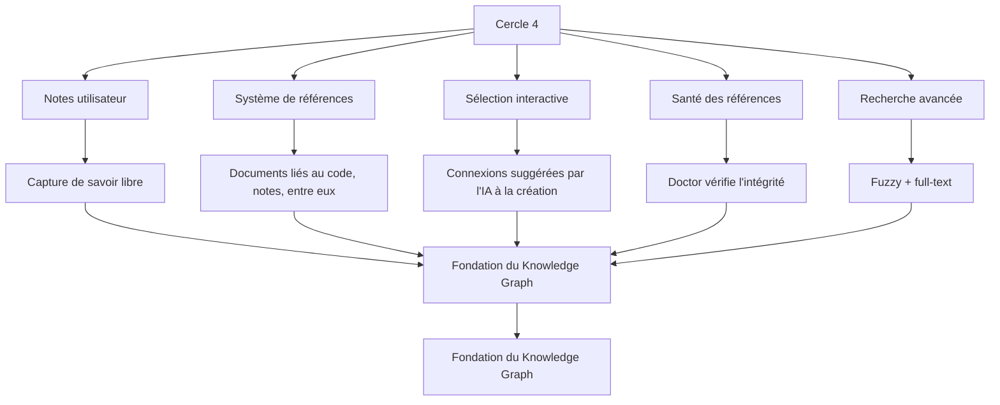

# Roadmap

Où va Lore — de la capture à l'intelligence.

## La vision globale



> **Aujourd'hui, Lore capture.** Demain, Lore comprend, connecte et partage.

## Ce qui est fait (Cercles 1 + 2 + 2b)

Le MVP est complet. Lore capture le "pourquoi" au moment du commit et le rend cherchable :

- **Capture** — Hook post-commit, 3 questions, mode Express, détection contextuelle
- **Recherche** — `lore show`, `lore list`, `lore status`
- **Cycle de vie** — Docs rétroactives, suppression, commits en attente
- **Maintenance** — `lore doctor`, validation config
- **IA** — Angela draft (zéro-API), polish (diff interactif), review (cohérence corpus)
- **Release** — `lore release` génère des notes depuis le corpus
- **Bilingue** — 634 strings EN/FR, i18n complet
- **Distribution** — Homebrew, Snap, Chocolatey, deb, rpm, apk, Go, curl
- **Intelligence** — Decision Engine (5 signaux, scoring 0-100), LKS SQLite
- **IDE** — Détection non-TTY, notifications VS Code

---

## Cercle 3 — Structure

*Votre corpus compte 80 documents. Ils sont tous dans un dossier plat. Certains ont été créés sur des branches de feature qui n'existent plus. Le template README convient à votre app web, mais l'équipe data pipeline a besoin de questions différentes. Et personne ne sait si l'équipe maintient vraiment l'habitude.*

*Le Cercle 3 résout ça.*

### Le problème des branches

Aujourd'hui, quand vous créez un document sur `feature/auth`, il vit dans `.lore/docs/` sans mémoire de son origine. Quand vous mergez dans `main`, le document est là — mais aussi ceux de 5 autres branches, dont certaines ont été abandonnées. Avec le temps, votre corpus accumule des orphelins : des documents liés à des branches supprimées, décrivant des features jamais livrées.

**La Consolidation de branches** ajoute la conscience :

- Chaque document reçoit un champ `branch` et `scope` dans son front matter — capturé automatiquement à la création
- `lore consolidate` regroupe les documents par feature après un merge — "Voici les 4 documents de la branche `feature/auth`, consolidés en une vue"
- `lore doctor` détecte les orphelins — documents liés à des branches supprimées — et suggère de les archiver
- `lore list --group-by scope` permet de parcourir le corpus par feature, pas seulement par date

C'est passer d'un journal chronologique à un cahier organisé avec des onglets par projet.

### Le problème des templates

Les 3 questions par défaut (Type, Quoi, Pourquoi) fonctionnent pour la plupart des commits. Mais chaque équipe a du contexte unique qu'elle aimerait capturer :

- Une équipe fintech veut "Impact réglementaire" sur chaque décision
- Un studio de jeux veut "Budget performance" sur chaque feature
- Un projet open source veut "Breaking Change ?" en oui/non

**Les Templates dynamiques** rendent ça possible :

- Un nouveau champ `extra` dans le front matter contient des paires clé-valeur custom
- Les templates sont définis dans `.lore/templates/` en YAML avec des questions conditionnelles
- Le moteur de templates branche : `si type == "decision" alors demander "Impact réglementaire"`
- Les templates sont hiérarchiques : projet → équipe → défauts intégrés
- Des hooks plugin (`pre-doc`, `post-doc`) permettent d'exécuter des scripts custom

Vous ne changez pas le cœur — vous l'étendez. Les 3 questions par défaut restent. Vos champs custom s'ajoutent par-dessus.

### Le problème de la motivation

La documentation est une habitude. Les habitudes ont besoin de renforcement. Sans feedback, les développeurs ne savent pas s'ils documentent assez, trop peu, ou de façon incohérente.

**Analytics & Gamification** ajoute de la visibilité :

- `lore stats` montre les tendances temporelles — documents par semaine, par type, par auteur, par scope
- **Streaks** — "Vous documentez chaque jour ouvré depuis 2 semaines" — un rappel doux pour continuer
- **Badges** — jalons comme "10 premiers documents", "Couverture 100% sur un mois", "Premier doc de décision"
- **Leaderboard équipe** — pas de la compétition, de la visibilité. "L'équipe a documenté 23 commits cette semaine."
- **Digest hebdomadaire** — un rapport exportable résumant l'activité de documentation de la semaine

La gamification est opt-in et légère. Pas de pop-ups, pas d'interruptions. Juste `lore stats` quand vous voulez vérifier, et un message occasionnel : *"🔥 12 jours de suite ! Votre projet se souvient pourquoi."*



---

## Cercle 4 — Connexions

*Vous avez 120 documents bien organisés. Mais ce sont des îles. Votre décision sur PostgreSQL ne pointe pas vers la feature qui l'a implémentée. Votre bugfix ne référence pas la note de la réunion de la semaine dernière où quelqu'un avait averti de ce cas limite exact. Le savoir est là, mais il est déconnecté.*

*Le Cercle 4 le tisse en réseau.*

### Des documents à un tissu de connaissances

Aujourd'hui, chaque document Lore est autonome. C'est comme avoir 120 articles Wikipedia sans aucun hyperlien. L'information existe, mais découvrir les connexions requiert de se souvenir qu'elles existent.

Le Cercle 4 introduit les **références** — les hyperliens de votre corpus de connaissances.

### Notes : le savoir au-delà des commits

Tout le savoir ne vient pas d'un commit. Certains viennent de réunions, de sessions de recherche, de conversations Slack, de revues d'architecture.

**Les Notes utilisateur** ajoutent `lore note` :

```bash
lore note create "Plan de migration PostgreSQL"
# Ouvre votre éditeur avec un template
# Sauvé dans .lore/notes/plan-migration-postgresql.md
```

Les notes vivent dans `.lore/notes/` aux côtés de vos documents dans `.lore/docs/`. Elles ont du front matter, elles sont indexées, cherchables avec `lore show`. Mais elles ne sont pas liées à un commit — c'est du savoir libre.

### Références : connecter les points

Le cœur du Cercle 4. Une directive `lore:ref` permet à tout document de pointer vers du code, des notes ou d'autres documents :

```markdown
## Pourquoi
Nous avons choisi JWT parce que l'auth par sessions nécessite Redis.
Voir lore:ref(decision-database-2026-02-10.md) pour comprendre pourquoi
nous évitons d'ajouter des dépendances d'infrastructure.

L'implémentation suit le pattern dans
lore:ref(code:internal/middleware/auth.go:ValidateToken).
```

Trois types de résolveurs :

| Résolveur | Ce qu'il lie | Exemple |
|-----------|-------------|---------|
| **doc** | Un autre document Lore | `lore:ref(decision-auth-2026-02.md)` |
| **note** | Une note utilisateur | `lore:ref(note:plan-migration.md)` |
| **code** | Un symbole dans le code source | `lore:ref(code:auth.go:ValidateToken)` |

### Sélection interactive : Lore suggère les connexions

Quand vous créez un nouveau document, Lore analyse le diff du commit et suggère du contenu lié :

```
? Documents liés trouvés :
  [x] decision-database-2026-02-10.md (mentionne "PostgreSQL")
  [ ] feature-user-model-2026-02-12.md (même scope : "auth")
  [x] note:plan-migration.md (tagué "database")

Lier les documents sélectionnés ? [O/n]
```

### Santé des références

Un réseau de références n'a de valeur que si les liens fonctionnent :

- `lore doctor` vérifie que toutes les références pointent vers des cibles existantes
- `lore status` affiche un compteur de santé : "42 refs, 2 obsolètes"
- `lore show --follow` re-extrait les références code en direct — si la fonction a bougé, la référence se met à jour

### Recherche avancée

Avec 200+ documents et notes, la recherche par mot-clé ne suffit plus :

- **Fuzzy search** — tolérant aux fautes, insensible aux accents. `lore show "authentification"` trouve "authentication"
- **Index full-text** — résultats instantanés sur les gros corpus. Pas de service externe — juste une table SQLite FTS5



---

## Ce qui vient après

Les Cercles 3 et 4 posent les fondations de quelque chose de plus grand. Le corpus que vous construisez aujourd'hui — structuré, connecté, cherchable — devient la matière première de fonctionnalités d'intelligence que nous concevons activement.

Le CLI restera toujours gratuit. Le corpus restera toujours le vôtre. Et le "pourquoi" que vous capturez aujourd'hui prendra de la valeur avec chaque future release.

> *Restez à l'écoute. Suivez le projet sur [GitHub](https://github.com/GreyCoderK/lore) pour être les premiers informés.*

## Voir aussi

- [Philosophie](philosophy.md) — Pourquoi Lore existe
- [Architecture](../contributing/architecture.md) — Comment Lore est construit
