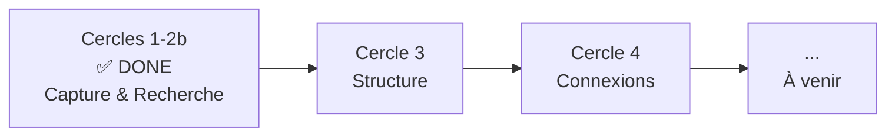

# Roadmap

Où va Lore — de la capture à l'intelligence.

## La vision globale

> **Aujourd'hui, Lore capture.** Demain, Lore comprend, connecte et partage.

## Ce qui est fait (Cercles 1 + 2 + 2b)

Le MVP est complet. Lore capture le "pourquoi" au moment du commit et le rend cherchable :

- **Capture** — Hook post-commit, 3 questions, mode Express, détection contextuelle
- **Recherche** — `lore show`, `lore list`, `lore status`
- **Cycle de vie** — Docs rétroactives, suppression, commits en attente
- **Maintenance** — `lore doctor`, validation config
- **IA** — Angela draft (zéro-API), polish (diff interactif + multi-pass + réécriture `--for` audience), review (cohérence corpus)
- **Angela Standalone** — Flag `--path` pour n'importe quel répertoire Markdown (sans `lore init`), `PlainCorpusStore` avec dégradation gracieuse
- **Angela CI** — GitHub Action composite (`action.yml`), script CI portable (`angela-ci.sh`), compatible GitHub Actions, GitLab CI, Jenkins, Bitbucket
- **VHS Cross-Check** — Détection des tapes orphelines, références GIF orphelines, incohérences CLI dans les fichiers `.tape`
- **Détection de langage** — 24 langages incluant la syntaxe VHS, auto-tagging des code fences dans `angela polish`
- **Preflight & Coût** — Estimation tokens, avertissements coût, abandon si trop gros, prédiction timeout avant appels API
- **Release** — `lore release` génère des notes depuis le corpus
- **Bilingue** — 700+ strings EN/FR, i18n complet
- **Distribution** — Homebrew, Snap, Chocolatey, deb, rpm, apk, Go, curl
- **Intelligence** — Decision Engine (5 signaux, scoring 0-100), LKS SQLite
- **IDE** — Détection non-TTY, notifications VS Code

---

## Cercle 3 — Structure

À mesure que votre corpus grandit, vous aurez besoin de mieux l'organiser. Le Cercle 3 se concentre sur la structuration des connaissances capturées — regrouper les documents liés, adapter le processus de capture aux besoins de votre équipe, et faire de la documentation une habitude durable.

**Thèmes en exploration :**

- Organiser les documents par scope fonctionnel plutôt que chronologiquement
- Adapter les questions de capture à différents contextes de projet
- Visibilité sur les habitudes de documentation et l'activité de l'équipe

---

## Cercle 4 — Connexions

Aujourd'hui, chaque document est autonome. Le Cercle 4 vise à les tisser en réseau connecté — lier les documents entre eux, au code, et aux connaissances libres qui ne viennent pas de commits.

**Thèmes en exploration :**

- Références croisées entre documents
- Capture de connaissances au-delà des commits (réunions, recherche, décisions)
- Recherche plus intelligente sur un corpus grandissant
- Vérification de l'intégrité des liens

---

## Ce qui vient après

Le corpus que vous construisez aujourd'hui — structuré, connecté, cherchable — devient la fondation de futures fonctionnalités d'intelligence. Les détails émergeront au fur et à mesure que nous livrerons les Cercles 3 et 4.

Le CLI restera toujours gratuit. Le corpus restera toujours le vôtre. Et le "pourquoi" que vous capturez aujourd'hui prendra de la valeur avec chaque future release.

> *Suivez le projet sur [GitHub](https://github.com/GreyCoderK/lore) pour rester informé.*

## Voir aussi

- [Philosophie](philosophy.md) — Pourquoi Lore existe
- [Architecture](../contributing/architecture.md) — Comment Lore est construit
