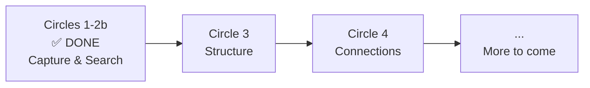

# Roadmap

Where Lore is heading — from capture to intelligence.

## The Big Picture

> **Today, Lore captures.** Tomorrow, Lore understands, connects, and shares.

## What's Done (Circles 1 + 2 + 2b)

The MVP is complete. Lore captures the "why" at commit-time and makes it searchable:

- **Capture** — Post-commit hook, 3 questions, Express mode, contextual detection
- **Search** — `lore show`, `lore list`, `lore status`
- **Lifecycle** — Retroactive docs, deletion, pending commits
- **Maintenance** — `lore doctor`, config validation
- **AI** — Angela draft (zero-API), polish (interactive diff + multi-pass + `--for` audience rewrite), review (corpus coherence)
- **Angela Standalone** — `--path` flag for any Markdown directory (no `lore init` required), `PlainCorpusStore` with graceful degradation (with or without YAML front matter)
- **Angela CI** — GitHub Action composite (`action.yml`), portable CI script (`angela-ci.sh`), works with GitHub Actions, GitLab CI, Jenkins, Bitbucket
- **VHS Cross-Check** — Detects orphan tapes, orphan GIF references, CLI command mismatches between `.tape` files and documentation
- **Language Detection** — 24 languages including VHS tape syntax, auto-tagging bare code fences in `angela polish`
- **Preflight & Cost** — Token estimation, cost warnings, abort-if-too-large, timeout prediction before API calls
- **Release** — `lore release` generates notes from corpus
- **Bilingual** — 700+ EN/FR strings, full i18n
- **Distribution** — Homebrew, Snap, Chocolatey, deb, rpm, apk, Go, curl
- **Intelligence** — Decision Engine (5 signals, scoring 0-100), LKS SQLite store
- **IDE** — Non-TTY detection, VS Code notifications

---

## Circle 3 — Structure

As your corpus grows, you'll need better organization. Circle 3 focuses on giving structure to the knowledge you've captured — grouping related documents, adapting the capture process to your team's needs, and making documentation a sustainable habit.

**Themes being explored:**

- Organizing documents by feature scope rather than just chronologically
- Adapting capture questions to different project contexts
- Visibility into documentation habits and team activity

---

## Circle 4 — Connections

Today, each document stands alone. Circle 4 is about weaving them into a connected network — linking documents to each other, to code, and to free-form knowledge that doesn't come from commits.

**Themes being explored:**

- Cross-references between documents
- Knowledge capture beyond commits (meetings, research, decisions)
- Smarter search across a growing corpus
- Health checks for link integrity

---

## What Comes After

The corpus you build today — structured, connected, searchable — becomes the foundation for future intelligence features. The details will emerge as we ship Circles 3 and 4.

The CLI will always stay free. The corpus will always stay yours. And the "why" you capture today will become more valuable with every future release.

> *Follow the project on [GitHub](https://github.com/GreyCoderK/lore) to stay informed.*

## See Also

- [Philosophy](philosophy.md) — Why Lore exists
- [Architecture](../contributing/architecture.md) — How Lore is built
