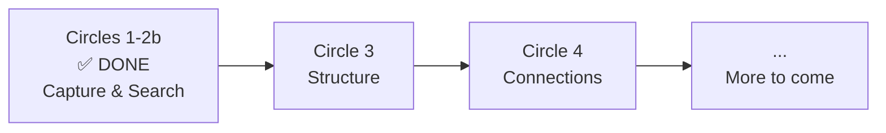
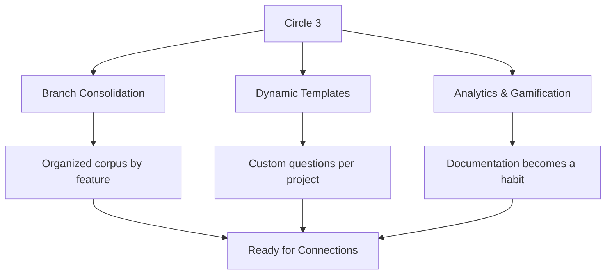
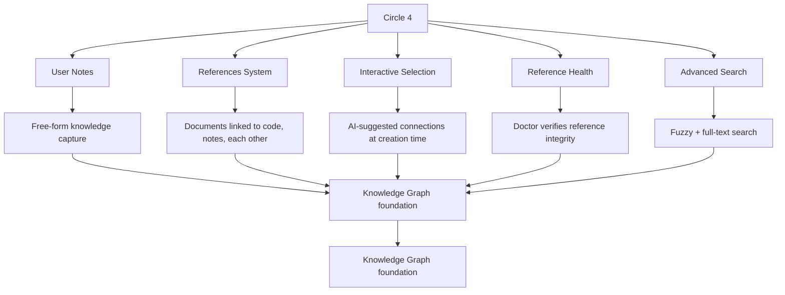

# Roadmap

Where Lore is heading — from capture to intelligence.

## The Big Picture



> **Today, Lore captures.** Tomorrow, Lore understands, connects, and shares.

## What's Done (Circles 1 + 2 + 2b)

The MVP is complete. Lore captures the "why" at commit-time and makes it searchable:

- **Capture** — Post-commit hook, 3 questions, Express mode, contextual detection
- **Search** — `lore show`, `lore list`, `lore status`
- **Lifecycle** — Retroactive docs, deletion, pending commits
- **Maintenance** — `lore doctor`, config validation
- **AI** — Angela draft (zero-API), polish (interactive diff), review (corpus coherence)
- **Release** — `lore release` generates notes from corpus
- **Bilingual** — 634 EN/FR strings, full i18n
- **Distribution** — Homebrew, Snap, Chocolatey, deb, rpm, apk, Go, curl
- **Intelligence** — Decision Engine (5 signals, scoring 0-100), LKS SQLite store
- **IDE** — Non-TTY detection, VS Code notifications

---

## Circle 3 — Structure

*Your corpus has 80 documents. They're all in one flat folder. Some were created on feature branches that no longer exist. The README template works for your web app, but your data pipeline team needs different questions. And nobody knows if the team is actually keeping up the habit.*

*Circle 3 solves this.*

### The Branch Problem

Today, when you create a document on `feature/auth`, it lives in `.lore/docs/` with no memory of where it came from. When you merge into `main`, the document is there — but so are documents from 5 other branches, some of which were abandoned. Over time, your corpus accumulates orphans: documents linked to branches that no longer exist, describing features that were never shipped.

**Branch Consolidation** adds awareness:

- Every document gets a `branch` and `scope` field in its front matter — automatically captured at creation time
- `lore consolidate` groups documents by feature after a merge — "Here are all 4 documents from the `feature/auth` branch, consolidated into one view"
- `lore doctor` detects orphans — documents linked to deleted branches — and suggests archiving them
- `lore list --group-by scope` lets you browse your corpus by feature, not just by date

Think of it like going from a chronological diary to an organized notebook with tabs per project.

### The Template Problem

The default 3 questions (Type, What, Why) work for most commits. But every team has unique context they wish they could capture:

- A fintech team wants "Compliance Impact" on every decision
- A game studio wants "Performance Budget" on every feature
- An open source project wants "Breaking Change?" as a yes/no field

**Dynamic Templates** makes this possible:

- A new `extra` field in the front matter holds custom key-value pairs
- Templates are defined in `.lore/templates/` as YAML files with conditional questions
- The template engine branches: `if type == "decision" then ask "Regulatory Impact"` 
- Templates are hierarchical: project-level → team-level → embedded defaults
- Plugin hooks (`pre-doc`, `post-doc`) let you run custom scripts before or after document creation

You don't change the core — you extend it. The 3 default questions stay. Your custom fields add on top.

### The Motivation Problem

Documentation is a habit. Habits need reinforcement. Without feedback, developers don't know if they're documenting enough, too little, or inconsistently.

**Analytics & Gamification** adds visibility:

- `lore stats` shows temporal trends — documents per week, by type, by author, by scope
- **Streaks** — "You've documented every workday for 2 weeks" — a gentle nudge to keep going
- **Badges** — milestones like "First 10 documents", "100% coverage for a month", "First decision doc"
- **Team leaderboard** — not competition, but visibility. "The team documented 23 commits this week."
- **Weekly digest** — an exportable report summarizing the week's documentation activity

The gamification is opt-in and lightweight. No pop-ups, no interruptions. Just `lore stats` when you want to check, and an occasional message in your terminal: *"🔥 12-day streak! Your project remembers why."*



---

## Circle 4 — Connections

*You have 120 well-organized documents. But they're islands. Your decision about PostgreSQL doesn't link to the feature that implemented it. Your bugfix doesn't reference the note from last week's meeting where someone warned about that exact edge case. The knowledge is there, but it's disconnected.*

*Circle 4 weaves it into a network.*

### From Documents to a Knowledge Fabric

Today, each Lore document stands alone. It has a title, a type, a date, and a "why." That's valuable — but it's like having 120 Wikipedia articles with no hyperlinks. The information exists, but discovering connections requires you to remember they exist.

Circle 4 introduces **references** — the hyperlinks of your knowledge corpus.

### Notes: Knowledge Beyond Commits

Not every piece of knowledge comes from a commit. Some come from meetings, research sessions, Slack conversations, or architecture reviews.

**User Notes** adds `lore note`:

```bash
lore note create "PostgreSQL migration plan"
# Opens your editor with a template
# Saved to .lore/notes/postgresql-migration-plan.md
```

Notes live in `.lore/notes/` alongside your documents in `.lore/docs/`. They have front matter, they're indexed, they're searchable with `lore show`. But they're not tied to a commit — they're free-form knowledge.

Use cases:
- Meeting notes: "We decided to deprecate the v1 API by March"
- Research: "Benchmarked 3 ORMs, here are the results"
- Warnings: "Don't touch the payment module before Q2 audit"

### References: Connecting the Dots

The heart of Circle 4. A `lore:ref` directive lets any document point to code, notes, or other documents:

```markdown
## Why
We chose JWT because session-based auth requires Redis.
See lore:ref(decision-database-2026-02-10.md) for why we avoid
adding infrastructure dependencies.

The implementation follows the pattern in
lore:ref(code:internal/middleware/auth.go:ValidateToken).
```

Three types of resolvers:

| Resolver | What it links to | Example |
|----------|-----------------|---------|
| **doc** | Another Lore document | `lore:ref(decision-auth-2026-02.md)` |
| **note** | A user note | `lore:ref(note:migration-plan.md)` |
| **code** | A symbol in source code | `lore:ref(code:auth.go:ValidateToken)` |

References are resolved during document generation (pipeline pass 2). If a referenced file moves or is deleted, `lore doctor` flags it as a broken reference.

### Interactive Selection: Lore Suggests Connections

When you create a new document, Lore analyzes the commit diff and suggests related content:

```
? Related documents found:
  [x] decision-database-2026-02-10.md (mentions "PostgreSQL")
  [ ] feature-user-model-2026-02-12.md (same scope: "auth")
  [x] note:migration-plan.md (tagged "database")

Link selected documents? [Y/n]
```

The picker works in both the post-commit hook (reactive) and `lore new` (proactive). You choose what to link — Lore never forces connections.

### Reference Health: Keeping the Web Intact

A web of references is only valuable if the links work. Circle 4 adds health checks:

- `lore doctor` verifies all references point to existing targets
- `lore status` shows a reference health counter: "42 refs, 2 stale"
- `lore show --follow` mode re-extracts code references live — if the function moved to a new file, the reference updates

### Advanced Search: Finding Anything

With 200+ documents and notes, keyword search isn't enough. Circle 4 adds:

- **Fuzzy search** — typo-tolerant, accent-insensitive. `lore show "authentification"` finds "authentication"
- **Full-text index** — a local search index for instant results on large corpora. No external service — just a SQLite FTS5 table rebuilt by `lore doctor`



---

## What Comes After

Circles 3 and 4 lay the foundation for something bigger. The corpus you build today — structured, connected, searchable — becomes the raw material for intelligence features we're actively designing.

The CLI will always stay free. The corpus will always stay yours. And the "why" you capture today will become more valuable with every future release.

> *Stay tuned. Follow the project on [GitHub](https://github.com/GreyCoderK/lore) to be the first to know.*

## See Also

- [Philosophy](philosophy.md) — Why Lore exists
- [Architecture](../contributing/architecture.md) — How Lore is built
