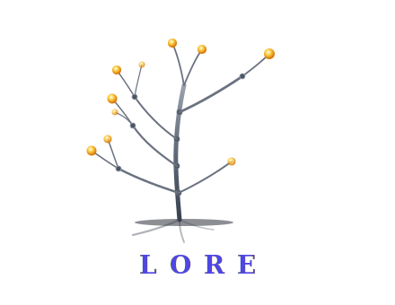
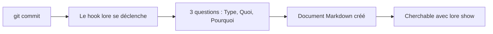

# Lore

> **L'or de vos décisions techniques.**




<!-- Générer : vhs assets/demo.tape -->

---

## Le problème

Vous êtes à 50 commits. Six mois plus tard, quelqu'un demande : *"Pourquoi on a fait ça comme ça ?"*

`git blame` montre **qui** a changé **quoi** et **quand** — mais pas **pourquoi**. Le raisonnement a disparu : enfoui dans un thread Slack, un commentaire de PR, ou la mémoire d'un développeur parti.

## La solution

Trois questions. Quatre-vingt-dix secondes. C'est fait.

```
$ git commit -m "feat: add JWT auth middleware"
  [1/3] Type [feature]:
  [2/3] What [add JWT auth middleware]:
  [3/3] Why? L'auth stateless scale mieux que les sessions
  ✓ Capturé : feature-add-jwt-auth-2026-03-16.md
```

lore s'intègre dans votre workflow Git et pose **3 questions** après chaque commit. Les réponses deviennent un fichier Markdown dans votre repo — cherchable, versionnable, portable. Pas de wiki. Pas de SaaS. Zéro friction.

## Comment ça marche



1. **Committez** votre code comme d'habitude
2. **Répondez à 3 questions** — Type, Quoi, Pourquoi (90 secondes)
3. **C'est fait** — Un document Markdown capture la décision pour toujours
4. **Cherchez** à tout moment avec `lore show "auth"` pour retrouver vos décisions

## Démarrage rapide

<div class="grid cards" markdown>

- :material-download: **[Installation](getting-started/installation.md)**

    Homebrew, Snap, Chocolatey, Go, curl — 9 méthodes sur macOS, Linux, Windows

- :material-rocket-launch: **[Quickstart](getting-started/quickstart.md)**

    De zéro à votre premier "pourquoi" capturé en 5 minutes

- :material-console: **[Commandes](commands/index.md)**

    Référence complète des 19 commandes

- :material-head-question: **[Philosophie](guides/philosophy.md)**

    Pourquoi lore existe et les principes qui le guident

</div>

## Conçu pour

- **Les développeurs solo** qui revisitent leur propre code des mois plus tard et se demandent *"pourquoi j'ai fait ça ?"*
- **Les équipes** qui perdent le savoir institutionnel quand les gens partent ou changent de poste
- **Les mainteneurs open source** qui veulent que les contributeurs comprennent les choix de design
- **Tous ceux** fatigués des décisions enfouies dans Slack, les commentaires de PR, ou la mémoire de quelqu'un

## Ce qui rend Lore différent

| | **Lore** | Swimm | Confluence | GitBook |
|---|---|---|---|---|
| **Quand** | Au commit | Après coup | Après coup | Après coup |
| **Où** | Local (`.lore/`) | SaaS | SaaS | SaaS |
| **Friction** | 90 secondes | 30 minutes | 30 minutes | 15 minutes |
| **IA** | Angela (opt-in) | Générique | Générique | Générique |
| **Lock-in** | Markdown | Propriétaire | Propriétaire | Mixte |
| **Prix** | Gratuit (AGPL) | $28/siège | $5,75/user | $8/user |

## Angela — Votre compagne IA de documentation

Angela est la revieweuse embarquée de lore — une collègue qui a lu chaque document que votre équipe a jamais écrit :

- **`lore angela draft`** — Analyse gratuite, hors ligne : sections manquantes, style, documents liés
- **`lore angela polish`** — Réécriture assistée par IA avec revue de diff interactive
- **`lore angela review`** — Vérification de cohérence du corpus : contradictions, docs isolés, lacunes

Angela est opt-in. Elle fonctionne avec Anthropic (Claude), OpenAI (GPT), ou Ollama (local). Le mode `draft` ne nécessite aucune clé API.

Angela fonctionne aussi comme **quality gate CI standalone** sur n'importe quel dossier Markdown — sans `lore init`. Ajoutez 3 lignes à votre GitHub Actions, GitLab CI ou Jenkins : [Angela en CI →](guides/angela-ci.md)

[Découvrir l'histoire d'Angela →](guides/philosophy.md#about-angela)

## En savoir plus

- [Comparaison](guides/comparaison.fr.md) — Comparaison détaillée avec les alternatives
- [Configuration](guides/configuration.md) — Personnalisez lore pour votre workflow
- [Types de documents](guides/document-types.md) — decision, feature, bugfix, refactor, note
- [Détection contextuelle](guides/contextual-detection.md) — Comment le hook décide quoi faire
- [Roadmap](guides/roadmap.md) — Où va lore
- [FAQ](faq.md) — Questions fréquentes
- [Architecture](contributing/architecture.md) — Pour les contributeurs
