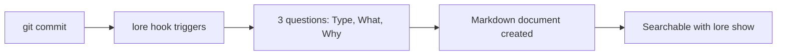

# Lore

> **Your code knows what. Lore knows why.**


<!-- Generate: vhs assets/demo.tape -->

---

## The Problem

You are 50 commits in. Six months later, someone asks: *"Why did we build it this way?"*

`git blame` shows **who** changed **what** and **when** — but not **why**. The reasoning is gone: buried in a Slack thread, a PR comment, or the memory of a developer who left.

## The Solution

Three questions. Ninety seconds. Done.

```
$ git commit -m "feat: add JWT auth middleware"
  [1/3] Type [feature]:
  [2/3] What [add JWT auth middleware]:
  [3/3] Why? Stateless auth scales better than sessions
  ✓ Captured: feature-add-jwt-auth-2026-03-16.md
```

lore hooks into your Git workflow and asks **3 questions** after every commit. The answers become a Markdown file in your repo — searchable, versionable, portable. No wiki. No SaaS. No friction.

## How it works



1. **Commit** your code as usual
2. **Answer 3 questions** — Type, What, Why (90 seconds)
3. **Done** — A Markdown document captures the decision forever
4. **Search** anytime with `lore show "auth"` to find past decisions

## Get Started

<div class="grid cards" markdown>

- :material-download: **[Installation](getting-started/installation.md)**

    Homebrew, Snap, Chocolatey, Go, curl — 9 ways to install on macOS, Linux, Windows

- :material-rocket-launch: **[Quickstart](getting-started/quickstart.md)**

    From zero to your first captured "why" in 5 minutes

- :material-console: **[Commands](commands/index.md)**

    Full reference for all 19 commands

- :material-head-question: **[Philosophy](guides/philosophy.md)**

    Why lore exists and the principles behind it

</div>

## Built for

- **Solo developers** who revisit their own code months later and wonder *"why did I do this?"*
- **Teams** that lose institutional knowledge when people leave or rotate projects
- **Open-source maintainers** who want contributors to understand design choices
- **Anyone** tired of decisions buried in Slack, PR comments, or someone's memory

## What makes Lore different

| | **Lore** | Swimm | Confluence | GitBook |
|---|---|---|---|---|
| **When** | Commit-time | After the fact | After the fact | After the fact |
| **Where** | Local (`.lore/`) | SaaS | SaaS | SaaS |
| **Friction** | 90 seconds | 30 minutes | 30 minutes | 15 minutes |
| **AI** | Angela (opt-in) | Generic | Generic | Generic |
| **Lock-in** | Markdown | Proprietary | Proprietary | Mixed |
| **Price** | Free (AGPL) | $28/seat | $5.75/user | $8/user |

## Angela — Your AI Documentation Companion

Angela is lore's embedded reviewer — a colleague who has read every document your team ever wrote:

- **`lore angela draft`** — Free, offline analysis: missing sections, style issues, related documents
- **`lore angela polish`** — AI-assisted rewrite with interactive diff review
- **`lore angela review`** — Corpus-wide coherence check: contradictions, isolated docs, coverage gaps

Angela is opt-in. She works with Anthropic (Claude), OpenAI (GPT), or Ollama (local). `draft` mode requires no API key.

Angela also works as a **standalone CI quality gate** on any Markdown directory — no `lore init` required. Add 3 lines to your GitHub Actions, GitLab CI, or Jenkins pipeline: [Angela in CI →](guides/angela-ci.md)

[Learn about Angela's story →](guides/philosophy.md#about-angela)

## Learn More

- [How lore Compares](guides/comparaison.md) — Detailed comparison with alternatives
- [Configuration](guides/configuration.md) — Customize lore for your workflow
- [Document Types](guides/document-types.md) — decision, feature, bugfix, refactor, note
- [Contextual Detection](guides/contextual-detection.md) — How the hook decides what to do
- [Roadmap](guides/roadmap.md) — Where lore is heading
- [FAQ](faq.md) — Common questions
- [Architecture](contributing/architecture.md) — For contributors
